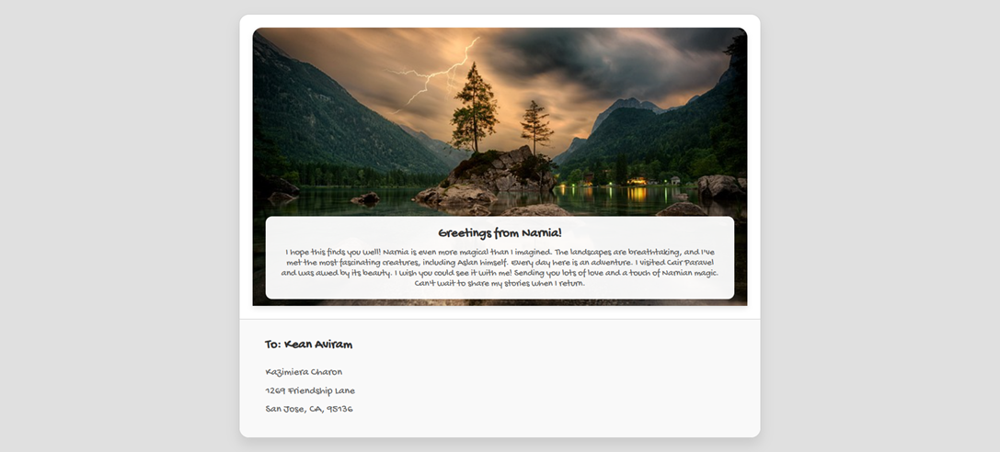

# Postcard

## Description
This project is a web page created using HTML5 and CSS3 that looks and behaves like the provided screenshot. The project uses the Google font Gochi Hand and is designed to open correctly in the latest version of Google Chrome.

## Live Demo
The project is deployed and can be viewed at the following link:  
[stalwart-sunshine-52228d.netlify.app](https://stalwart-sunshine-52228d.netlify.app/)

## Requirements
- Valid HTML5 and CSS3
- Use of the Google font Gochi Hand
- Proper display in the latest version of Google Chrome

## Screenshot
